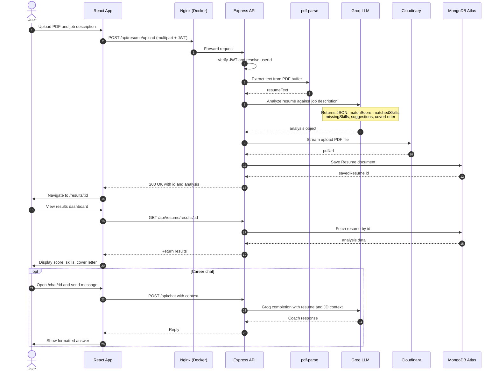

# ApplyEdge

ApplyEdge is a full-stack web application that helps job seekers analyze a resume against a job description using AI. Users receive a match score, skill gap analysis, improvement suggestions, a generated cover letter, and an interactive career-coach chat grounded in their resume and target role.

## Features

- User registration and login (email/password with bcrypt)
- Google OAuth 2.0 sign-in
- Forgot-password flow with 6-digit OTP (email delivery via Brevo, Resend, or Gmail SMTP)
- PDF resume upload with text extraction
- AI-powered resume vs. job description analysis (Groq / Llama 4 Scout)
- Cloudinary storage for uploaded PDFs
- Results dashboard (match score, matched/missing skills, suggestions, cover letter)
- Resume history and re-analysis against new job descriptions
- Context-aware AI career chat per analysis session

## Tech Stack

| Layer | Technologies |
|-------|----------------|
| Frontend | React 19, React Router v7, Tailwind CSS, Axios |
| Backend | Node.js, Express, Multer, JWT, Passport (Google OAuth) |
| Database | MongoDB Atlas, Mongoose |
| AI | Groq API (`meta-llama/llama-4-scout-17b-16e-instruct`) |
| Storage | Cloudinary (PDF) |
| Email | Brevo API (production), Nodemailer/Gmail SMTP (local), Resend (optional fallback) |
| Deployment | Docker Compose, Nginx, Render |

## Prerequisites

Before cloning, install the following on your machine:

- [Git](https://git-scm.com/)
- [Node.js](https://nodejs.org/) 20.x or later
- [npm](https://www.npmjs.com/) (included with Node.js)
- [Docker Desktop](https://www.docker.com/products/docker-desktop/) (optional, for containerized local run)

You will also need accounts and API keys for:

- MongoDB Atlas (database)
- Groq (AI analysis and chat)
- Cloudinary (PDF storage)
- Brevo (recommended for password-reset email on Render; optional locally)
- Google Cloud Console (optional, for Google OAuth)

## Clone the Repository

```bash
git clone https://github.com/sai-chaitanya-raj/ApplyEdge.git
cd ApplyEdge
```

Replace the URL above with your fork or repository URL if different.

## Environment Setup

1. Copy the example environment file:

```bash
cp .env.example .env
```

2. Open `.env` and fill in your credentials. Never commit `.env` to Git.

| Variable | Required | Description |
|----------|----------|-------------|
| `MONGODB_URI` | Yes | MongoDB Atlas connection string |
| `JWT_SECRET` | Yes | Secret for signing JWT tokens |
| `SESSION_SECRET` | Yes | Express session secret (Google OAuth) |
| `GROQ_API_KEY` | Yes | Groq API key for resume analysis and chat |
| `CLOUDINARY_CLOUD_NAME` | Yes | Cloudinary cloud name |
| `CLOUDINARY_API_KEY` | Yes | Cloudinary API key |
| `CLOUDINARY_API_SECRET` | Yes | Cloudinary API secret |
| `BREVO_API_KEY` | Production | Brevo API key (HTTPS; works on Render free tier) |
| `BREVO_SENDER_EMAIL` | Production | Verified sender email in Brevo |
| `BREVO_SENDER_NAME` | No | Display name for outbound email (default: ApplyEdge) |
| `SMTP_USER` / `SMTP_PASS` | Local dev | Gmail address and app password (local/Docker without Brevo) |
| `GOOGLE_CLIENT_ID` / `GOOGLE_CLIENT_SECRET` | Optional | Google OAuth credentials |
| `CLIENT_URL` | Yes | Frontend URL (e.g. `http://localhost:3000` or your Render frontend URL) |
| `SERVER_URL` | Yes | Backend URL (e.g. `http://localhost:5000` or your Render backend URL) |
| `REACT_APP_API_URL` | Render frontend | Backend base URL baked into React build (e.g. `https://your-api.onrender.com`) |

### Email on Render

Render free tier blocks outbound SMTP (ports 587, 465). Use Brevo:

1. Sign up at [https://www.brevo.com](https://www.brevo.com)
2. Add and verify a sender email under **Senders**
3. Create an API key under **SMTP & API**
4. Set `BREVO_API_KEY`, `BREVO_SENDER_EMAIL`, and `NODE_ENV=production` on the backend service

### Google OAuth (optional)

1. Create a project in Google Cloud Console
2. Enable Google+ API / OAuth consent screen
3. Create OAuth 2.0 credentials (Web application)
4. Authorized redirect URI: `{SERVER_URL}/api/auth/google/callback`
5. Set `GOOGLE_CLIENT_ID` and `GOOGLE_CLIENT_SECRET` in `.env`

## Running the Application

Choose one of the following methods.

### Option 1: Docker Compose (recommended for full-stack local test)

Runs the React build behind Nginx on port 80 and proxies `/api` to the backend container.

```bash
# From project root — ensure .env is configured
docker compose build
docker compose up
```

Open [http://localhost](http://localhost) in your browser.

Useful commands:

```bash
docker compose down          # Stop containers
docker compose logs backend  # View API logs
docker compose logs frontend # View Nginx logs
```

Docker sets `NODE_ENV=development` for the backend container. If `BREVO_API_KEY` is set in `.env`, email uses Brevo; otherwise Gmail SMTP is used when configured.

### Option 2: Local development (two terminals)

Best for active frontend/backend development with hot reload on the React app.

**Terminal 1 — Backend:**

```bash
# From project root
npm install
npm run dev
```

API runs at [http://localhost:5000](http://localhost:5000).

**Terminal 2 — Frontend:**

```bash
cd client
npm install --legacy-peer-deps
npm start
```

App runs at [http://localhost:3000](http://localhost:3000). The CRA dev server proxies `/api` requests to port 5000 (see `client/package.json`).

Set in `.env`:

```env
CLIENT_URL=http://localhost:3000
SERVER_URL=http://localhost:5000
```

### Option 3: Deploy to Render (production)

The repository includes `render.yaml` for a Blueprint with two services:

- **applyedge-api** — Node.js web service (backend)
- **applyedge-web** — Static site (React build)

Steps:

1. Push the repository to GitHub
2. In Render: **New** > **Blueprint** > connect the repo
3. Fill secret environment variables when prompted
4. Set `CLIENT_URL` on the backend to your frontend Render URL
5. Set `REACT_APP_API_URL` on the frontend to your backend Render URL, then redeploy the frontend
6. Do not set `PORT=5000` manually on Render; let Render assign the port

Update the rewrite destination in `render.yaml` if your backend service name differs from `applyedge-api`.

## Project Structure

```
ApplyEdge/
├── client/                 # React frontend
│   ├── public/
│   ├── src/
│   │   ├── pages/          # Landing, Analyze, Results, Chat, Auth
│   │   ├── components/
│   │   └── utils/api.js    # Axios client
│   ├── Dockerfile
│   ├── nginx.conf          # SPA config (Render / default Docker)
│   └── nginx.docker.conf   # Docker Compose: proxies /api to backend
├── src/                    # Express backend
│   ├── config/             # database, email, groq, cloudinary, passport
│   ├── controllers/        # auth, resume, chat, forgotPassword
│   ├── middleware/         # JWT auth
│   ├── models/             # User, Resume
│   └── routes/
├── docker-compose.yml
├── Dockerfile              # Backend image
├── render.yaml             # Render Blueprint
├── .env.example
└── README.md
```

## API Overview

| Method | Endpoint | Auth | Description |
|--------|----------|------|-------------|
| POST | `/api/auth/register` | No | Create account |
| POST | `/api/auth/login` | No | Login, returns JWT |
| GET | `/api/auth/google` | No | Start Google OAuth |
| POST | `/api/auth/forgot-password` | No | Send OTP email |
| POST | `/api/auth/verify-otp` | No | Verify OTP |
| POST | `/api/auth/reset-password` | No | Reset password |
| POST | `/api/resume/upload` | JWT | Upload PDF + job description, run analysis |
| GET | `/api/resume/results/:id` | JWT | Get analysis results |
| GET | `/api/resume/history` | JWT | List user's past resumes |
| POST | `/api/resume/analyze-existing` | JWT | Re-analyze saved resume |
| POST | `/api/chat` | JWT | Career coach chat message |
| GET | `/health` | No | Health check |

## System Architecture

The diagram below shows the end-to-end flow when a user uploads a resume and runs an analysis.



On Render without Docker, the React static site calls the backend directly via `REACT_APP_API_URL` instead of passing through local Nginx.

## Troubleshooting

| Issue | Likely cause | Fix |
|-------|----------------|-----|
| 500 on resume upload | Invalid PDF or missing API keys | Check backend logs for `STEP X FAILED`; ensure Groq and Cloudinary keys are set |
| Frontend cannot reach API (Docker) | Backend not healthy | Run `docker compose logs backend`; wait for MongoDB connection |
| Frontend crash loop (Docker) | Old Nginx template conflict | Rebuild: `docker compose build --no-cache` |
| Email not sent on Render | SMTP blocked or missing Brevo | Set `BREVO_API_KEY` and verified `BREVO_SENDER_EMAIL`; redeploy backend |
| Email not sent locally | Wrong provider | With `BREVO_API_KEY` set, Brevo is used; otherwise configure Gmail app password |
| CORS errors on Render | `CLIENT_URL` mismatch | Set `CLIENT_URL` to exact frontend URL (no trailing slash) |
| Google OAuth redirect error | Callback URL mismatch | Match redirect URI to `{SERVER_URL}/api/auth/google/callback` |
| Analyze timeout on Render | Cold start + AI latency | Client timeout is 120s; upgrade plan or retry after service wakes |

## License

ISC (see `package.json`).

## Author

Built as a portfolio full-stack AI application. Update repository links and live demo URLs in this README for your own deployment.
